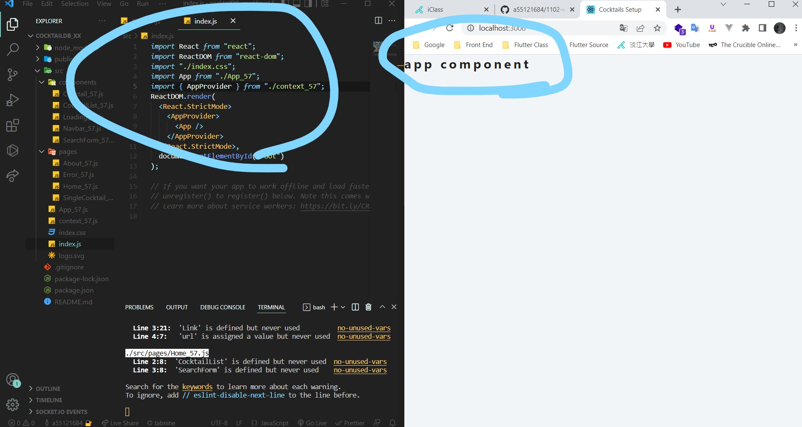
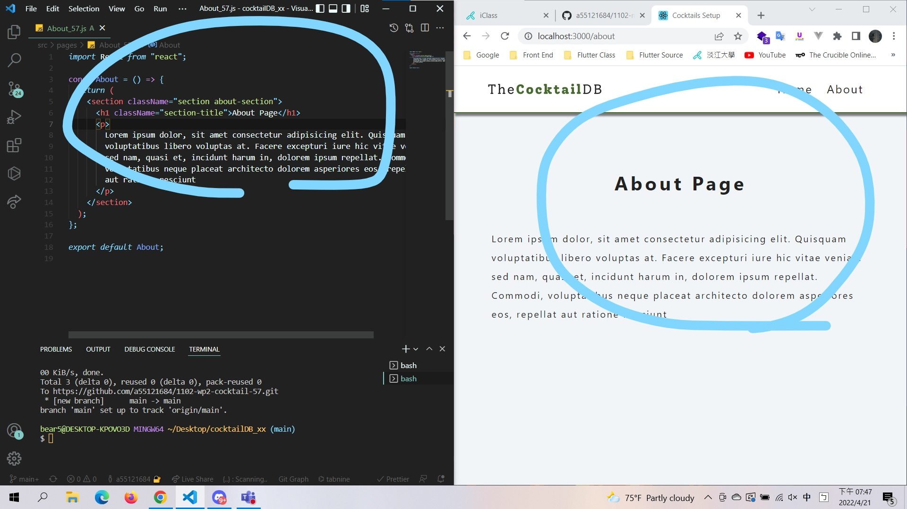
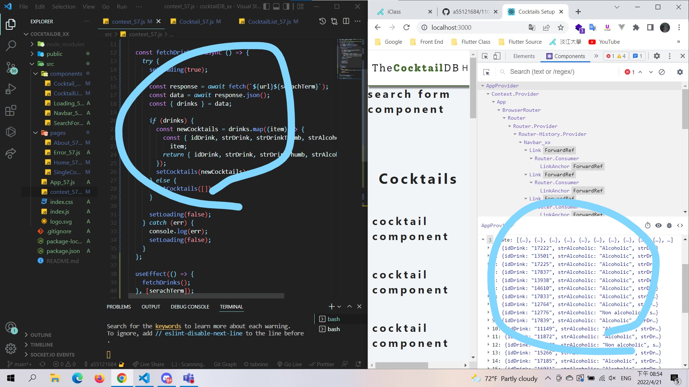
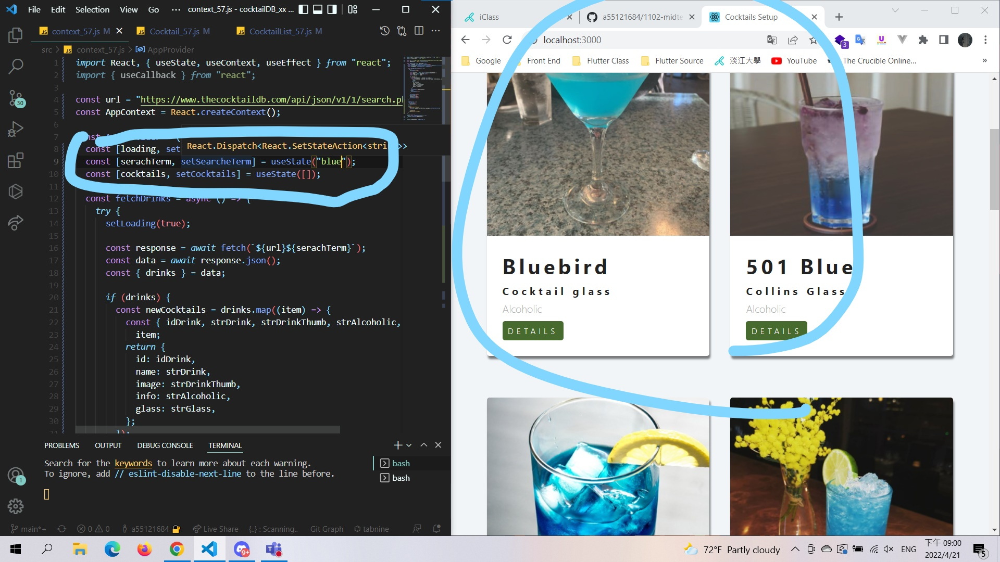
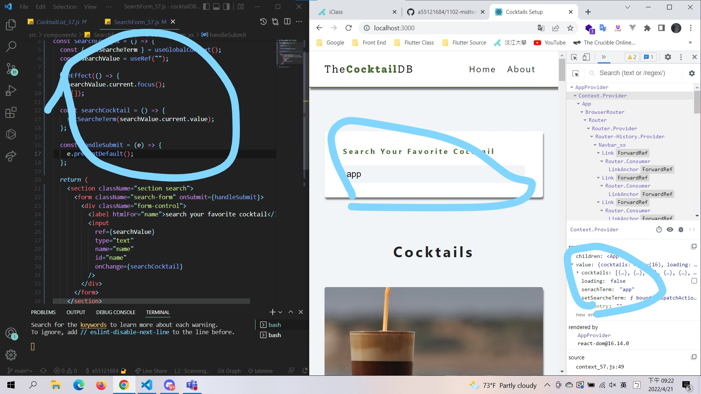
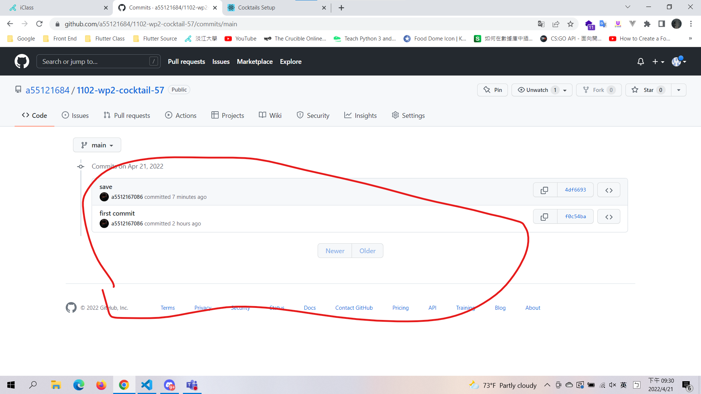

### W09-P1:initial setup, change component name by add 

### W09-P2:<about_02> <Error_02> <Navbar_02>

### W09-p3:finish context.js and fetch data shown in DevTools

### w09-P4 Show Cocktails with your own searchTerm

### W09-P5: Show Cocktails using searchTerm.

### w09-P6 All log message in Github

